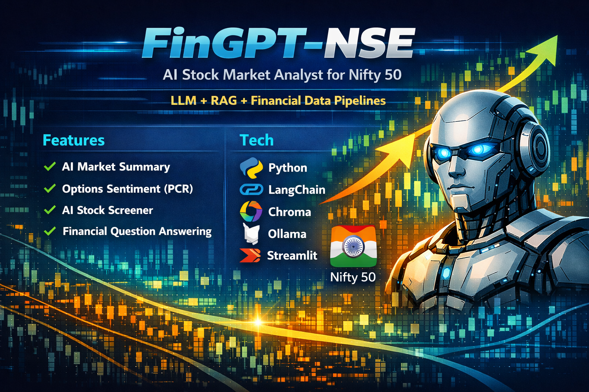
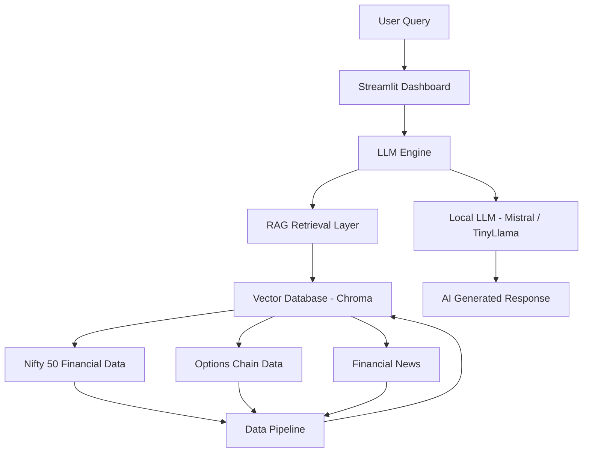

# FinGPT-NSE

## AI Stock Market Analyst for Nifty 50 using LLM + RAG

### Overview

FinGPT-NSE is an experimental AI system that analyzes **Nifty 50 stocks from the Indian stock market** using a combination of:

• Large Language Models (LLMs)
• Retrieval Augmented Generation (RAG)
• Financial data pipelines
• Options market analytics

The system can:

* Answer questions about Nifty 50 companies
* Generate daily AI market summaries
* Analyze options market sentiment using PCR
* Screen fundamentally strong stocks
* Provide AI explanations for stock market movements

This project demonstrates how to build a **financial AI assistant similar to FinGPT** using open-source tools.

---

# Key Features

### 1. AI Market Summary

Automatically generates a **daily Nifty market report** using an LLM.

Example output:

```
Nifty closed slightly higher today driven by gains in banking and IT stocks.
Reliance and ICICI Bank led the rally while FMCG stocks remained flat.
Market sentiment remains cautiously bullish.
```

---

### 2. Options Chain Sentiment Analysis

The system fetches **Nifty options chain data** and calculates the **Put-Call Ratio (PCR)**.

PCR Interpretation:

| PCR       | Market Sentiment |
| --------- | ---------------- |
| < 0.7     | Bearish          |
| 0.7 – 1.2 | Neutral          |
| > 1.2     | Bullish          |

Example output:

```
Put Call Ratio: 1.15
Market Sentiment: Neutral to Bullish
```

---

### 3. AI Stock Screener

The project screens **Nifty 50 companies** using financial metrics such as:

* PE Ratio
* Return on Equity
* Market Cap

Example output:

```
Stock      PE      ROE
TCS        24.1    0.43
INFY       22.8    0.36
```

---

### 4. AI Question Answering

Users can ask questions like:

```
Which banking stocks are in Nifty 50?
Analyze Reliance fundamentals
Which IT companies are strong in Nifty?
What does the current PCR indicate?
```

The system retrieves relevant financial data and generates an AI explanation.

---

# Architecture

```
User Question
     │
     ▼
Streamlit Dashboard
     │
     ▼
LLM Engine
     │
     ▼
RAG Retrieval Layer
     │
 ┌────┼──────────────┬─────────────┐
 ▼    ▼              ▼             ▼
Nifty Stock Data   Market News   Options Chain
     │
     ▼
Vector Database (Chroma)
     │
     ▼
Local LLM (Mistral / TinyLlama)
```

---

# Tech Stack

Python
PyTorch
LangChain
Chroma Vector Database
Ollama LLM Runtime
Streamlit Dashboard
YFinance API

---

# Hardware Used

Laptop: MSI Katana 15
CPU: Intel i7-12650H
GPU: NVIDIA RTX 3050 (6GB)
RAM: 16GB
OS: Ubuntu Linux

---

# Project Structure

```
fingpt-nse
│
├── data
│
├── ingestion
│   ├── fetch_nifty50_data.py
│   ├── fetch_options_chain.py
│   └── fetch_market_news.py
│
├── analytics
│   ├── market_summary.py
│   ├── options_analysis.py
│   └── stock_screener.py
│
├── rag
│   ├── build_vector_db.py
│   └── query_engine.py
│
├── llm
│   └── llm_engine.py
│
├── app
│   └── ui.py
│
├── requirements.txt
└── README.md
```

---

# Installation

Clone the repository

```
git clone https://github.com/halovivek/fingpt-nse.git
cd fingpt-nse
```

Install dependencies

```
pip install -r requirements.txt
```

---

# Install Local LLM

Install Ollama

```
curl -fsSL https://ollama.com/install.sh | sh
```

Download a model

```
ollama run mistral
```

---

# Fetch Nifty 50 Data

```
python ingestion/fetch_nifty50_data.py
```

---

# Build Vector Database

```
python rag/build_vector_db.py
```

---

# Run Dashboard

```
streamlit run app/ui.py
```

The AI dashboard will open in your browser.

---

# Example Dashboard

FinGPT NSE Dashboard

Daily Market Summary
Options Market Sentiment
AI Stock Screener
Ask AI about Nifty stocks

---

# Example Questions

```
Why did Nifty fall today?
Analyze TCS fundamentals
Which banking stocks are strong in Nifty?
What does the PCR indicate today?
```

---

# Future Improvements

Planned upgrades:

* Real-time NSE data ingestion
* Financial news sentiment analysis
* Portfolio recommendation system
* Options strategy suggestions
* Daily AI market report automation

---
## System Architecture



# Author

Vivek Rajagopalan

Senior Engineering / Delivery Leader exploring AI, LLM systems and financial AI applications.

---

# License

This project is for educational and research purposes.
